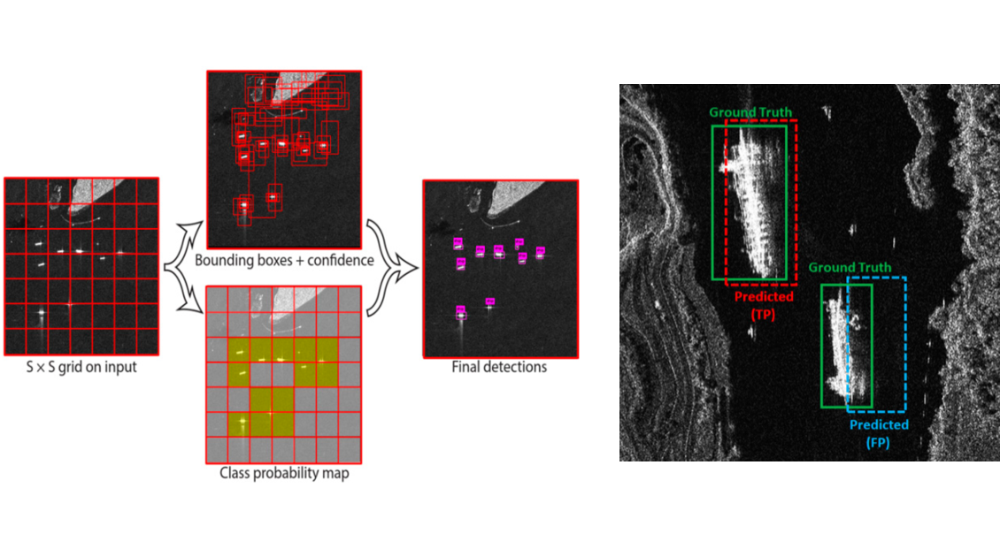
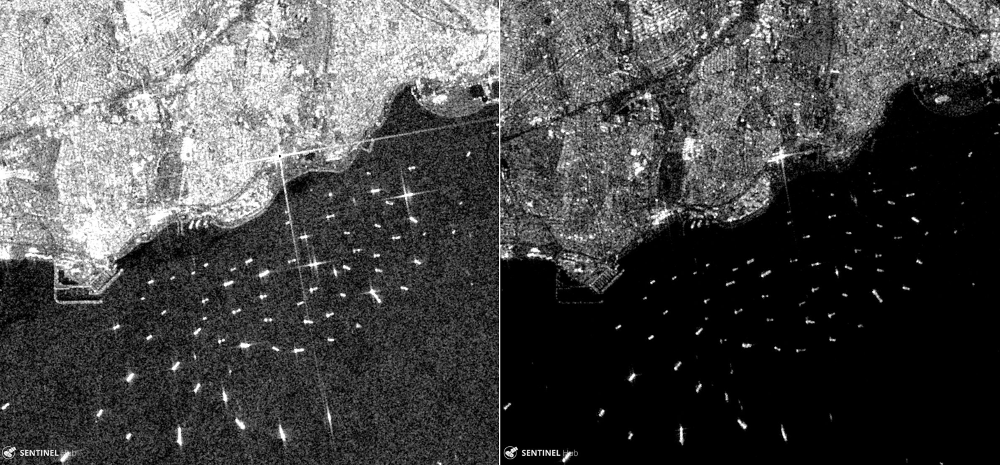
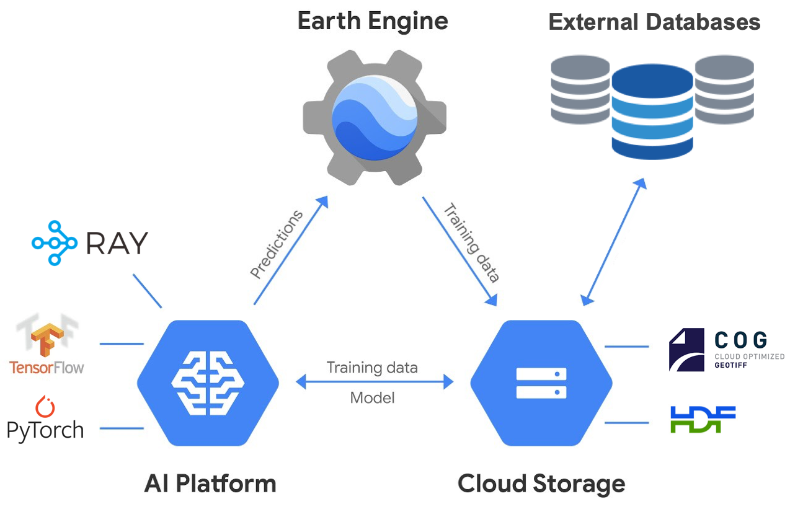

# Global vessel detection system

> Tracking vessel activity in the global oceans from space with AI and cloud computing

# What is this about?

A project to develop a state-of-the-art automated system for tracking, classifying and reporting vessel activities worldwide. The objective is two-fold: improve vessel detection accuracy and workflow efficiency. The approach leverages freely-available satellite radar and optical imagery, and state-of-the-art AI algorithms on cloud infrastructure for global-scale monitoring of ships in the oceans. The development is a two-step process: First, implement an artificial neural network framework for ship detection using freely available SAR amplitude data that can be scaled globally. Second, with a fully working object-detection system in place, extend the data capability and model sophistication to improve detection accuracy, assimilating SAR polarization data and optical imagery.

# Why should we care? 

Illegal and unsustainable fishing practices can deplete marine resources and endanger food security. Illegal, unreported and unregulated (IUU) fishing affects legitimate commercial fishers, impacts the accuracy of stock estimates, and induce severe damage to non-target species and vulnerable marine ecosystems. It is estimated that IUU fishing impacts the global economy on the billion-dollar-scale annually. Most developing countries do not have sufficient infrastructure in place to monitor vessel activity at large scale.

# How can we improve detection?

In recent years, AI computer vision methods have dominated the analyses of natural, medical and satellite images. AI-driven approaches have been shown to outperform standard statistical methods on complex tasks such as classification, object detection and semantic segmentation of massive data streams from surveillance systems, mobile devices, and commercial satellites. Unlike standard statistical methods that are data-type specific, Convolutional Neural Networks (CNN) have been implemented on a wide range of image types and complex backgrounds. CNNs are a natural way forward to improve upon and extend the capabilities of current ship detection systems (moving beyond CFAR-based methods).

We propose to implement and test three CNN architectures for object detection: [YOLOv3](https://pjreddie.com/darknet/yolo/), [Faster R-CNN](https://towardsdatascience.com/faster-r-cnn-object-detection-implemented-by-keras-for-custom-data-from-googles-open-images-125f62b9141a), and [SSD](https://towardsdatascience.com/review-ssd-single-shot-detector-object-detection-851a94607d11), as some studies suggest these are among the best performing CNNs for the task of ship detection on satellite images (see refs below). Python implementations of these CNNs on top of TensorFlow and/or PyTorch are also available. Typical outputs from these analysis are the center coordinates, bounding box, and class probability of the objects, a convenient way to report location, size and uncertainty of detected vessels.

Although the use of all-day/all-weather SAR amplitude images (by CFAR systems) constitutes a significant improvement over traditional optical methods (suffering from cloud coverage and light conditions), single-channel SAR images still suffer from inherent speckle noise, azimuth ambiguities, and low contrast on low backscattering background, characteristic of rough ocean environments. Also, in-shore ships can be confounded with the infrastructure of harbors, with similar brightness and shapes.

We propose to use additional information such as SAR polarization and co-located detections from optical imagery. Numerous studies have used Polarimetric SAR data for ship-detection problems (see refs below). The idea is that backscattering from a complex structure (a ship) consists of a mixture of single-bounced, double-bounced and depolarized scatterings, and only a strong single-bounce or double-bounce scatterer will produce (certain) ambiguities in azimuth, allowing the separation of the different scatterers (ship and sea). Different combination modes of polarization channels can be used to increase the ship-ocean contrast and train CNN models to better recognize vessel features. Because the same CNN architectures can be trained with optical images, we also plan to incorporate detections from optical sensors. This will allows us to better estimate uncertainties on co-located predictions (SAR + Optical), evaluate and adapt network architecture (why a detection is possible on one image type but not the other), and provide historical context for large vessels (e.g. from the Landsat archive). For ground truth, we will rely on the Automatic Identification System (AIS) carried by most medium-to-large ships.

  

  

# How can we improve efficiency?

While [Google Earth Engine](https://earthengine.google.com/) allows geospatial analysis at planetary scale by providing pre-processed satellite imagery and convenient access to analysis tools, it also has significant limitations within the scope of this project. The capability of the analysis tools is limited, with little-to-no support for modern neural-net powered machine learning. Predictions are bottlenecked by exports and intermediate file formats. Scaling is limited, and it is difficult (sometimes impossible) to implement custom image analysis operations such as filtering, transforming, and augmenting.

Recently, Google has integrated the Earth Engine with [TensorFlow](https://www.tensorflow.org/) and the [AI Platform](https://cloud.google.com/ai-platform). The AI Platform integrates other services such as the [Cloud Storage](https://cloud.google.com/storage), the [BigQuery](https://cloud.google.com/bigquery) data warehouse, and Google's powerful [Cloud Compute Engine](https://cloud.google.com/compute). Through the AI Platform we can also access external databases and, perhaps most importantly, we can implement different deep learning frameworks (such as [PyTorch](https://pytorch.org/)) and CPU/GPU parallel architectures (such as [Ray](https://towardsdatascience.com/modern-parallel-and-distributed-python-a-quick-tutorial-on-ray-99f8d70369b8)).

We propose to move not only the processing-predicting workflow to Google's AI Platform, but also (given its convenient GUI/SSH interface) move the full development stack from code prototyping and hyperparameter tuning to large-scale data visualization. A further improvement in the efficiency of our system is the adoption of cloud-optimized parallelization and data formats, such as 

[Ray](https://github.com/ray-project/ray) - A fast and simple framework for building and running distributed applications. Ray is packaged with [RLlib](https://docs.ray.io/en/latest/rllib.html), a scalable reinforcement learning library, [Tune](https://docs.ray.io/en/latest/tune.html), a scalable hyperparameter tuning library, and [Modin](https://github.com/modin-project/modin), a scalable high-performance DataFrame.

[HDF5](https://www.hdfgroup.org/) and [Zarr](https://medium.com/pangeo/cloud-performant-reading-of-netcdf4-hdf5-data-using-the-zarr-library-1a95c5c92314) - Hierarchical open source data formats that support large, complex, heterogeneous, chunked and compressed N-dimensional data. These formats are optimal for fast synchronous I/O operations (i.e. parallelization) of numerical types.

[COG](https://www.cogeo.org/) - A cloud optimized GeoTIFF file aimed at being hosted on a HTTP file server, with an internal organization that enables more efficient workflows on the cloud. It does this by leveraging the ability of clients issuing HTTP GET range requests to ask for just the parts of a file they need.

  

  

Some practical considerations to keep in mind. Overall, the vessel detection framework needs to be:

- **Fast** - aiming at near-real time detections in future
- **Transparent** - to facilitate implementation and modifications
- **Scalable** - identify and asses scalability bottlenecks early on
- **Automated** - with as minimal human intervention as possible
- **Proven** - technologies are mature and/or have been successfully applied
- **Documented** - throughout the full dev process to be accessible by any team member
- **Open** - based on actively maintained open-source code and publicly-available data

  

> **NOTE.** Because we want to minimize the development time, it seems practical not focusing on the SAR phase information in the first implementation of the system. This is experimental and will likely require substantial research. This will also require additional development as the complex data is not easily available and the phase information requires sophisticated pre-processing. We aim at implementing, testing and adapting working methods first, and then investigating further improvements to the vessel-detection problem.

# Roadmap

### Architect pipeline

* Identify data sources
* Identify data formats (original -> system input -> system output)
* Identify ingestion mechanism (cloud-to-cloud, external-to-cloud)
* Identify task-specific parallelization (CPU vs. GPU)
* Architect cloud workflow (input -> transform -> develop -> predict -> test -> deploy)
* Identify task automation (some human intervention will be needed in the pipeline)
* Make shareable/editable documentation

### Develop proof of concept

* Implement a simplified/reduced version of the above pipeline
* Select a few (manageable) locations with data availability
* Device data labeling strategy (manual vs semi-automated)
* Implement CNN methods (YOLOv3, Faster R-CNN, and SSD)
* Figure out optimal data transformation (filtering, cropping, etc.)
* Figure out best data augmentation approach (key aspect, large effort!)
* Figure out representative training/testing data sets (little info available for remote sensing)
* Every ML implementation needs a baseline! We have the CFAR implementation :)
* Develop web-based visualization to inspect and track intermediate results
* Make shareable/editable documentation

### Implement upscaled version

* Workout with engineers the infrastructure (will need a lot of engineering!)
* Perform global analyses
* Synthesize and distribute data
* Publish (high-impact) paper

### Improve implemented system

* Better data augmentation
* Assimilate polarization and optical information
* Extended object classes (containers, navy, cargo, passenger, fishing, etc.)
* Incorporate historic information to delineate strategic areas (e.g. protected ecosystems)
* Device automated warning system? (when vessel type crosses pre-defined boundary)
* Investigate other AI methods to our problem (e.g. semantic segmentation)
* Investigate the use of SAR phase information 
* Investigate better uncertainty estimation 

# Final thoughts

Given the adoption of novel technologies and global scope of the project, significant challenges still remain. As the project develops, we will test and update our adopted strategies. A significant effort will be required to train and evaluate the CNN models at global scale; as well as generating optimal labeled training SAR data sets.

**A word of caution.** There is no guarantee that a deep learning approach will outperform a (standard) working method. An optimal DL model for a specific problem relies on numerous trial-and-error tests (i.e. brute force), where the model is tuned for the specific data in question. Success heavily relies on a combination of creativity and domain expertise.

The file [example.ipynb](example.ipynb) is a Jupyter Notebook with a simple exercise to test setting up a basic CNN on a cloud GPU instance.

### References and Credits

Some figures have been adapted from Google and the following references:

PolSAR for small ship detection - https://www.mdpi.com/2072-4292/11/24/2938/htm

PolSAR method for ship detection - https://ieeexplore.ieee.org/document/8900480

PolSAR and ship detection - https://www.researchgate.net/publication/224116934_Ship_detection_from_polarimetric_SAR_images

SAR dataset for deep learning - https://www.mdpi.com/2072-4292/11/7/765/htm

Status of vessel detection with SAR - https://www.researchgate.net/publication/308917393_Current_Status_on_Vessel_Detection_and_Classification_by_Synthetic_Aperture_Radar_for_Maritime_Security_and_Safety

