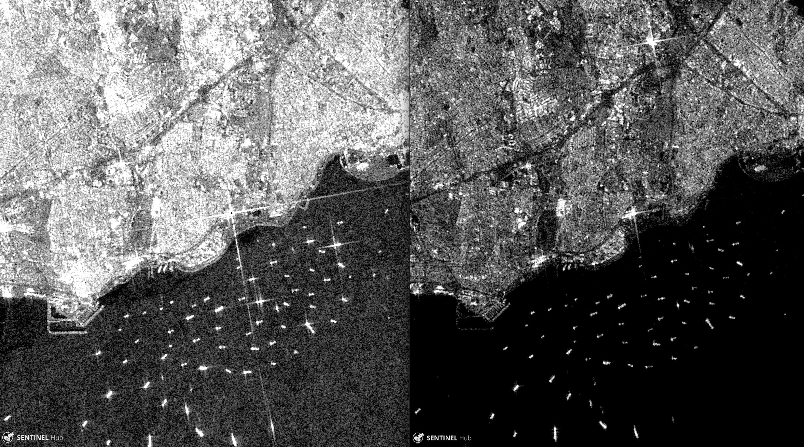

# Global vessel detection system

Tracking vessel activity in the global oceans from space with AI and cloud computing

[Eye catching figure here]

## Summary 

We propose to develop a state-of-the-art automated system for tracking, classifying and reporting vessel activities worldwide. The objective of this project is two-fold: improve vessel detection accuracy and efficiency of computations. Our approach leverages freely-available satellite radar and optical imagery, and state-of-the-art AI algorithms and cloud computing for global-scale monitoring of the oceans. We propose a two-step development process: First, implement an artificial neural network framework for ship detection using freely available Synthetic Aperture Radar (SAR) amplitude data that can be scaled globally. Second, with a fully working object-detection system in place, extend the data capability and model sophistication to improve detection accuracy, assimilating SAR polarization data and optical imagery.

## Motivation 

*Why do we need this?* Illegal and unsustainable fishing practices can deplete marine resources and endanger food security. Illegal, unreported and unregulated (IUU) fishing, which is most prominent in countries with weak fisheries management and lax law enforcement, affects legitimate commercial fishers, impacts the accuracy of stock estimates, and induce severe damage to non-target species and vulnerable marine ecosystems. It is estimated that IUU fishing impacts the global economy on the billion-dollar-scale annually. Most developing countries do not have sufficient infrastructure in place to monitor vessel activity at large scale. And current global approaches rely on [describe deficiencies of CFAR]. There is a need for assessing activities 

## Improve detection

[AI, polarimetry, optical,...]

## Improve efficiency

[Google compute engine, Ray, optimized data formats,...]

## Challenges

[in narrative summarize challenges from papers] data, infrastructure, global validation

- pre-trained models on RS images
- limited labeled RS data for training

**NOTE** I will not attempt to use the SAR phase information in the first implementation of the system. This is experimental and will likely require substantial research. This will also require additional development on the data engineering side: (a) data is not easily available and (b) the complex information will need to be pre-processed. I would first implement a DL framework to analyze Amplitude, then think how to incorporate Polarization and Optical information, and then (if we decide it’s worth pursuing based on small-scale tests) investigate incorporating Phase information.

Make clear this proposal is of practical character. We do not intent to develop new machine learning methods, but instead we aim to implement, test and adapt working methods and investigate optimal practices for the problem in question.

## Technical Overview

Regarding the choice of technologies and strategies adopted to develop the vessel detection system, there are a few practical considerations that must be taken into account. Overall, the framework needs to be:

- fast (aiming at near-real time detections in future)
- transparent (to facilitate implementation and modifications)
- scalable (identify and asses scalability bottlenecks early on)
- automated (or with as minimal human intervention as possible)
- proven (has been successfully applied, and showed potential to outperform CFAR)
- documented (accessible by any team member)
- open (based on actively maintained open-source code and publicly-available data)

Next we provide a sketch of the proposed development steps depicting the structure and rationale of the project. 

**[Be more specific (data sources, PolSAR, technical pre-processing, libraries/tools, NN arch]**

**[Also consider figures/visuals to make the points]**

**Architect pipeline**
* Identify data sources
* Identify data formats (original->optimal pipeline input->intermediate pipeline steps->output)
* Identify ingestion mechanism (cloud1->cloud2, external->cloud2)
* Identify cloud parallel framework (CPU and GPU)
* Architect cloud workflow: source1 + sourceN -> transformations -> cloud storage -> cloud development env (with access to storage and compute) -> cloud testing env (benchmarking/visualization) -> cloud deployment space -> cloud output
* Identify automation of pipeline steps (likely some human intervention will be needed at some points. What are those?)
* Make shareable/editable documentation

**Develop proof of concept**
* Implement a simplified/reduced version of the above pipeline
* Parallel framework: example, Ray for data pre-proc and ML preparation
* Select a couple DL approaches. Likely candidates: YOLOv3, Faster R-CNN (say why?)
* select a few (manageable) locations with identified data availability
* Data labeling (manual vs automated?)
* Figure out best data augmentation approach (key aspect, large effort)
* Figure out representative training/testing data sets (what features need to be in the train/test data for best results? This is mostly unknown for remote sensing)
* Every DL implementation needs a baseline! We have the CFAR method :)
* Develop web-based visualization
* Make shareable/editable documentation

**Implement upscaled version**
* Think about challenges in this section [will need a lot of engineering]
* Perform global analyses
* Publish paper

**Improve implemented system**
* Data augmentation: how?
* Data combination (optical + radar)
* Incorporate historic information to map out risk areas, common zones/typical routes, etc.
* Automated warning system? E.g. send message when vessel type crosses pre-defined boundary: intersection of polygon map with vessel location map
* Investigate how iceberg tracking methods apply to our problem
* Investigate how to merge optical imagery
* Combine results from CFAR and NN (evaluate differences)

How to test/validate system
Use AIS data

**Section on Polarimetric SAR**

[how can we use this information?]

**Challenges**
* Main challenges: 
	- Perform analysis at global scale (how to automate the full pipeline for global coverage and how to assess model performance/reliability of results at global scale)
	- How to generate optimal training SAR data set (quality and quantity)
* Other challenges:
	- Speckle noise (how to pre-process SAR for optimal training)
	- Sea state challenge (rough vs smooth)
	- Coastal challenge (multiple ship-like objects)
	- Cluster challenge (stack of ships: marinas)

## Final thoughts

What if it doesn't work? There is no guarantee that a Deep Learning approach will outperform a working method. The achievement of an optimal DL model for a specific problem relies on numerous trial-and-error tests (i.e. brute force), where the model is tuned for the specific data in question. Success heavily relies on a combination of creativity and domain expertise. If potential for outperforming the current approach is not evident at the initial stages (after substantial investigation), an alternative approach should be considered. For example, improving the current CFAR method with more traditional ML algorithms for pre- and post-processing SAR data and the inclusion of auxiliary information.
